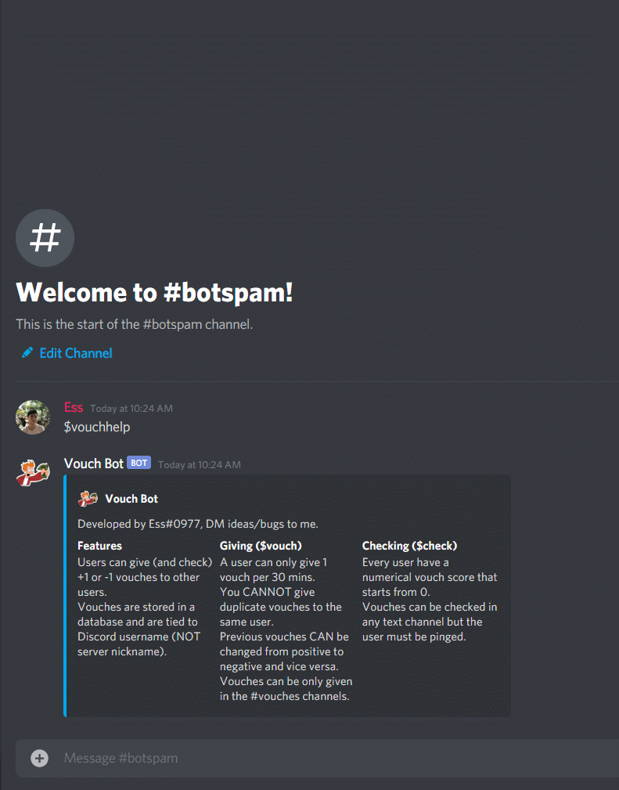

# Discord Vouch Bot

A Discord bot that allow users within a server to give each other positive or negative vouches. Vouch score is saved in a SQLite database.
Currently serving the **NA AAU Megaserver (1000+ users).**

### Stack
* Python (bot, modules, models)
* discord.py (API wrapper for Discord)
* SQLite3 (data persistence)
* SQLAlchemy + Alembic (ORM and migration)
* Docker + Docker Compose (for easy deployment, volume mounted for DB)
* AWS (EC2) instance (Amzn linux platform)

### Commands
Users have two commands: `$vouch` and `$check`
* `$vouch @user +1/-1` to give vouches to users. Existing vouches can be changed from +1 to -1 and vice versa.
* `$check @user`  to check a user's vouches. `$check @user history` to check a user's vouch history
* `$vouchhelp` for more info

Admins have the above commands and `$adminvouch`
* `$adminvouch @user #` Manually sets a users vouch to specified #. Can only by users with Admin role.
